<p align="center">
  
</p>

[](https://github.com/arquisoft/yovi_en1c/actions/workflows/release-deploy.yml)
[](https://sonarcloud.io/summary/new_code?id=Arquisoft_yovi_en1c)
[](https://sonarcloud.io/summary/new_code?id=Arquisoft_yovi_en1c)

# 📝 Introduction

This is a UniOvi project for the Software Architecture course in 2025/2026.

# 👥 Team members

- Fernando Cachón Alonso (@fercalonso)
- Javier Yáñez Luzón (@JavierYanez23)
- Elif Busra Caylan (@ebus99)
- Joona Santeri Pikkarainen (@fjopi016)

## 📚 Documentation

The architecture documentation is based on the **Arc42** template. You can find it in the following link 👉 **[View Project Documentation](https://arquisoft.github.io/yovi_en1c/)**

## 🏗️ Project Structure

The project is divided into several main components:

- **`webapp/`**: A frontend application built with React, Vite, and TypeScript.
- **`gateway/`**: An Express service acting as a proxy to expose backend services.
- **`users/`**: A backend service for user management (Node.js/Express) using **MongoDB**.
- **`gamey/`**: A Rust-based game engine and bot service.
- **`docs/`**: Architecture documentation following Arc42.

## ✨ Features

- **User Registration** 👤: The web application provides a simple form to register new users.
- **Webapp** 🏢: A lobby where the user can decide the parameters to play.
- **GameY** 🎲: A basic Game engine which only chooses a random piece.

## 🛠️ Component breakdown

### 💻 Webapp

The `webapp` is a single-page application (SPA) created with [Vite](https://vitejs.dev/) and [React](https://reactjs.org/).

- `src/App.tsx`: The main component of the application.
- `src/RegisterForm.tsx`: The component that renders the user registration form.
- `package.json`: Contains scripts to run, build, and test the webapp.
- `vite.config.ts`: Configuration file for Vite.
- `Dockerfile`: Defines the Docker image for the webapp.

### 🛡️ Gateway Service

The `gateway` service is the **public API entry point**, built with [Node.js](https://nodejs.org/) and [Express](https://expressjs.com/).

- **API Routing**: Exposes public endpoints (like `/adduser`, `/login`) and proxies requests to the appropriate internal services.
- `gateway-service.js`: The main file that handles request routing and security.
- `openapi.yaml`: The API specification following the OpenAPI standard.
- `monitoring/`: Contains configurations for service monitoring and health checks.
- `Dockerfile`: Defines the Docker image for the gateway service.

### 📂 Users Service

The `users` service is an **internal REST API** that handles user persistence and business logic.

- `users-service.js`: The main file for the service logic.
- `db.js`: Manages the **MongoDB** connection using **Mongoose**. It includes automatic database seeding with test data when running in non-production environments.
- `package.json`: Contains scripts to start the service.
- `Dockerfile`: Defines the Docker image for the user service.

### 🎮 Gamey

The `gamey` component is a Rust-based game engine with bot support, built with [Rust](https://www.rust-lang.org/) and [Cargo](https://doc.rust-lang.org/cargo/).

- `src/main.rs`: Entry point for the application.
- `src/lib.rs`: Library exports for the gamey engine.
- `src/bot/`: Bot implementation and registry.
- `src/core/`: Core game logic including actions, coordinates, game state, and player management.
- `src/notation/`: Game notation support (YEN, YGN).
- `src/web/`: Web interface components.
- `Cargo.toml`: Project manifest with dependencies and metadata.
- `Dockerfile`: Defines the Docker image for the gamey service.

## 🚀 Running the Project

You can run this project using Docker (recommended) or locally without Docker.

### 🐳 With Docker

This is the easiest way to get the project running. You need to have [Docker](https://www.docker.com/) and [Docker Compose](https://docs.docker.com/compose/) installed.

1.  **Build and run the containers:**
    From the root directory of the project, run:

    ```bash
    docker-compose up --build
    ```

    This command will build the Docker images for the services and start them.

2.  **Access the application:**
    - Web application: [http://localhost](http://localhost)
    - Gateway service API: [http://localhost:3000](http://localhost:8000)

3.  **Extra considerations:**
    If you also want the front-end to hot-reload when saving changes, you need to modify the Dockerfile in the webapp module. Replace the last command with:
    ```bash
    CMD ["npm", "start"]
    ```
    instead of:
    ```bash
    CMD ["npm", "run", "prod"]
    ```
    ⚠️ Important
    If you modify the Dockerfile, make sure it is not included in your commits. To prevent this, you can add it to your .gitignore file.

### 💻 Without Docker

To run the project locally without Docker, you will need to run each component in a separate terminal.

#### Prerequisites

- [Node.js](https://nodejs.org/) and npm installed.

#### 1. Running the database

You first need to run a MongoDB instance. You can either install MongoDB locally or start it using Docker:

    docker run -d -p 27017:27017 --name=my-mongo mongo:latest

Alternatively, you can use a cloud-hosted database service such as MongoDB Atlas.

#### 2. Running the Gateway Service

Navigate to the `gateway` directory:

```bash
cd gateway
```

Install dependencies:

```bash
npm install
```

Run the service:

```bash
npm start
```

#### 3. Running the User Service

Navigate to the `users` directory:

```bash
cd users
```

Install dependencies:

```bash
npm install
```

Run the service:

```bash
npm start
```

The user service will be available at `http://localhost:3000`.

#### 4. Running the Web Application

Navigate to the `webapp` directory:

```bash
cd webapp
```

Install dependencies:

```bash
npm install
```

Run the application:

```bash
npm run dev
```

The web application will be available at `http://localhost:5173`.

#### 5. Running the GameY application

At this moment the GameY application is not needed but once it is needed you should also start it from the command line.

## 🧪 Available Scripts

Each component has its own set of scripts defined in its `package.json`. Here are some of the most important ones:

### Webapp (`webapp/package.json`)

- `npm run dev`: Starts the development server for the webapp.
- `npm test`: Runs the unit tests.
- `npm run test:e2e`: Runs the end-to-end tests.
- `npm run start:all`: A convenience script to start both the `webapp` and the `users` service concurrently.

### Gateway (`gateway/package.json`)

- `npm start`: Starts the user service.
- `npm test`: Runs the tests for the service.

### Users (`users/package.json`)

- `npm start`: Starts the user service.
- `npm test`: Runs the tests for the service.

### Gamey (`gamey/Cargo.toml`)

- `cargo build`: Builds the gamey application.
- `cargo test`: Runs the unit tests.
- `cargo run`: Runs the gamey application.
- `cargo doc`: Generates documentation for the GameY engine application

## ☁️ Deployment Environment Setup

The deployment machine can be created using cloud providers such as Microsoft Azure or Amazon AWS. In general, the virtual machine should meet the following requirements:

    - A Linux system running Ubuntu 20.04 or later (Ubuntu 24.04 is recommended).
    - Docker installed on the system.
    - The necessary network ports open for the application services:
        - Port 3000 for the web application
        - Port 8000 for the gateway service

## Installing Docker

After creating the virtual machine, you can install Docker by running the following commands:

    sudo apt update
    sudo apt install apt-transport-https ca-certificates curl software-properties-common
    curl -fsSL https://download.docker.com/linux/ubuntu/gpg | sudo apt-key add -
    sudo add-apt-repository "deb [arch=amd64] https://download.docker.com/linux/ubuntu focal stable"
    sudo apt update
    sudo apt install docker-ce
    sudo usermod -aG docker ${USER}

These steps install Docker and add your user to the docker group, allowing you to run Docker commands without needing sudo.
