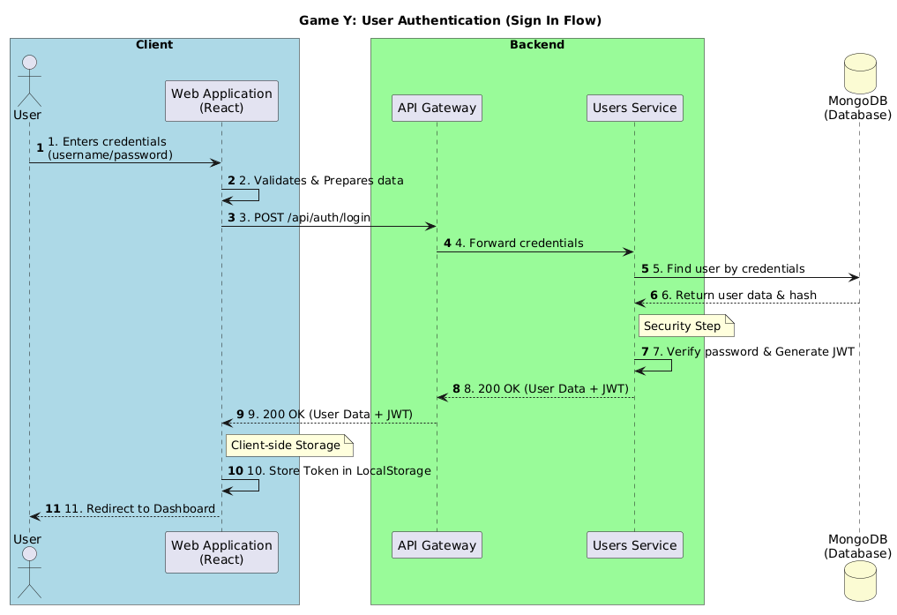
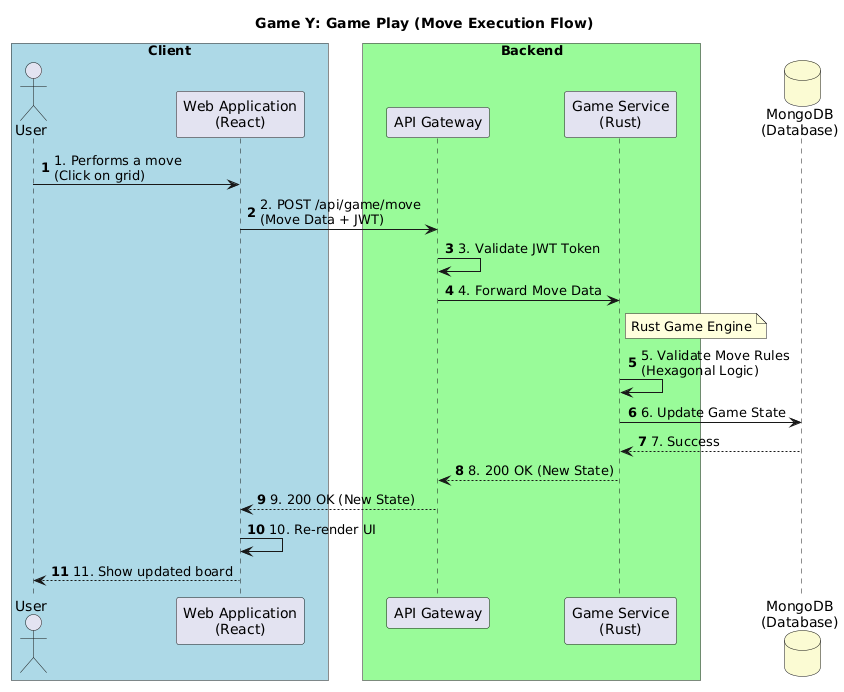
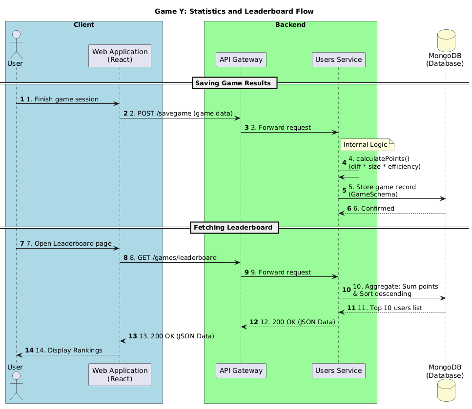

ifndef::imagesdir[:imagesdir: ../images]

[[section-runtime-view]]
== Runtime View

The runtime view describes the dynamic behavior of the Game Y system. It focuses on how different building blocks (Frontend, Gateway, Services and Database) communicate with each other during specific execution scenarios.

=== User Registration (Sign Up)
When a new user wants to join the system, the data must be sanitized and securely stored.

**Scenario Steps:**

[cols="1,4" options="header"]
|===
| **Step** | **Description**
| 1 | The **User** fills the registration form in the **Web Application**.
| 2 | The **Web Application** validates and prepares the input data to ensure it meets the required format before transmission.
| 3 | The **Web Application** sends a POST request to the **API Gateway**.
| 4 | The **API Gateway** forwards the request to the **Users Service**.
| 5 | The **Users Service** checks if the username is unique and hashes the password.
| 6 | The **Users Service** stores the record in **MongoDB** and returns a success response.
|===

image::../images/signup2.png[Sign Up Diagram]

=== User Authentication (Sign In)
The authentication process verifies the user credentials and provides a secure session token (JWT).

**Scenario Steps:**

[cols="1,4" options="header"]
|===
| **Step** | **Description**
| 1 | The **User** enters their username and password in the **Web Application**.
| 2 | The **Web Application** validates the input format and sends a POST request to the **API Gateway**.
| 3 | The **API Gateway** forwards the login request to the **Users Service**.
| 4 | The **Users Service** retrieves the stored user data and password hash from **MongoDB**.
| 5 | The **Users Service** compares the hashes and, if successful, generates a **JWT Token**.
| 6 | The **Web Application** receives the token and stores it securely for subsequent requests.
|===

=== Game Play (Move Execution)
This flow describes how a user performs an action within the game and how the system validates and updates the game state.

**Scenario Steps:**

[cols="1,4" options="header"]
|===
| **Step** | **Description**
| 1 | The **User** performs a move (e.g., placing a piece) on the **Web Application**.
| 2 | The **Web Application** sends the move details along with the **JWT Token** to the **API Gateway**.
| 3 | The **API Gateway** validates the token and forwards the move to the **Game Service**.
| 4 | The **Game Engine** (Core Logic) validates the move based on the hexagonal grid rules.
| 5 | The **Game Service** updates the game state in **MongoDB**.
| 6 | The system returns the updated game state to the **Web Application** to refresh the UI.
|===

=== Statistics and Leaderboard Flow
This flow explains how game results are persisted and how performance metrics (points, win rates) are retrieved for the leaderboard.

**Scenario Steps:**

[cols="1,4" options="header"]
|===
| **Step** | **Description**
| 1 | The **Web Application** sends the game outcome (moves, difficulty, result) to the `/savegame` endpoint.
| 2 | The **Users Service** calculates points based on difficulty and efficiency using the `calculatePoints` logic.
| 3 | The game record is persisted in the **MongoDB** `games` collection.
| 4 | When a user views the leaderboard, the **Web Application** requests the top scores from the `/games/leaderboard` endpoint.
| 5 | The **Users Service** executes a MongoDB aggregation to sum points per user and returns the top 10 players.
| 6 | The **Web Application** renders the statistics and ranking for the user.
|===

